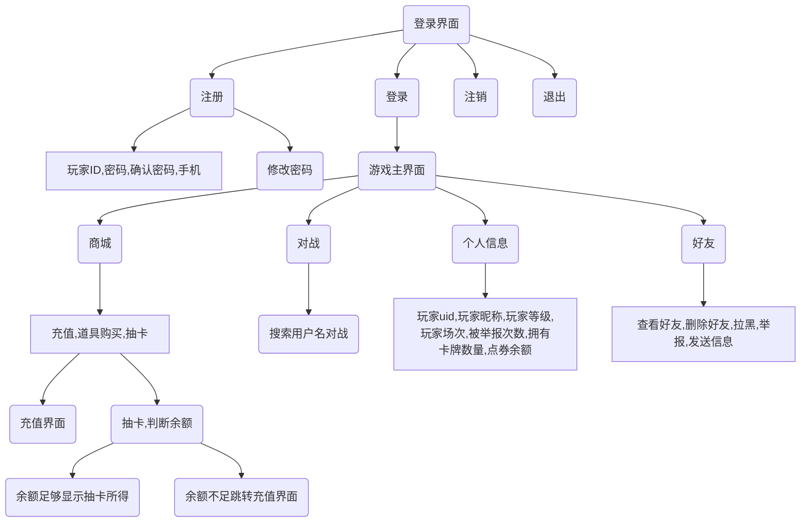

# Mooer Village Knights Cards

## main module of JavaClosingHomework

<h1>

</h1>
<h2>

### 要使用本模块请下载Release [gitee](https://gitee.com/saarchaffee/JavaClosingHomework/releases) or [github](https://gitee.com/saarchaffee/JavaClosingHomework/releases) 中的jar包，在IDE中导入包，最后`import main.*`即可食用

### 方法的详细说明请移步[API文档](docs/main/api.md)

### 本模块涉及大量结果集方法，相关说明请移步[ResultRet快速说明](docs/ResultSet.md)

### 完整项目请移步[MooerVillageKnightsCards](https://github.com/SaarChaffee/MooerVillageKnightsCards)

</h2>

